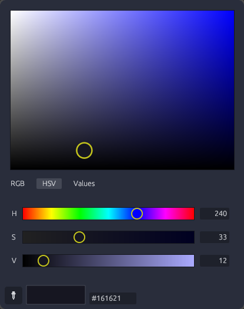

# WayColor

A simple colorpicker for [Hyprland](https://hyprland.org/), backing in `hyprpicker`, and rendered as a lightweight `egui`/`eframe` GUI.



## Features

- **Screen picking** — click the picker button to activate `hyprpicker` and grab any pixel on the screen.
- **Six-channel fine-tuning** — RGB and HSV sliders with live gradient tracks.
- **Numeric / Hex input** — type a channel value directly, or paste a hex (`#RRGGBB` or a bare `RRGGBB`, case-insensitive) into the hex field.

## Requirements

- **`hyprpicker`** — WayColor shells out to `/bin/hyprpicker` to do the actual screen picking. Install it first (see below).
- A Wayland session running Hyprland (the app is built for it).

## Install

### From source

```bash
git clone https://github.com/lifer0se/WayColor.git
cd WayColor
cargo build --release
# the binary is at target/release/waycolor
```

### Dependency first

On Arch (Package Manager):

```bash
sudo pacman -S hyprpicker
```

## License

[MIT](LICENSE)